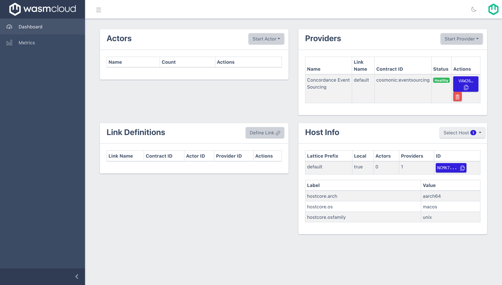
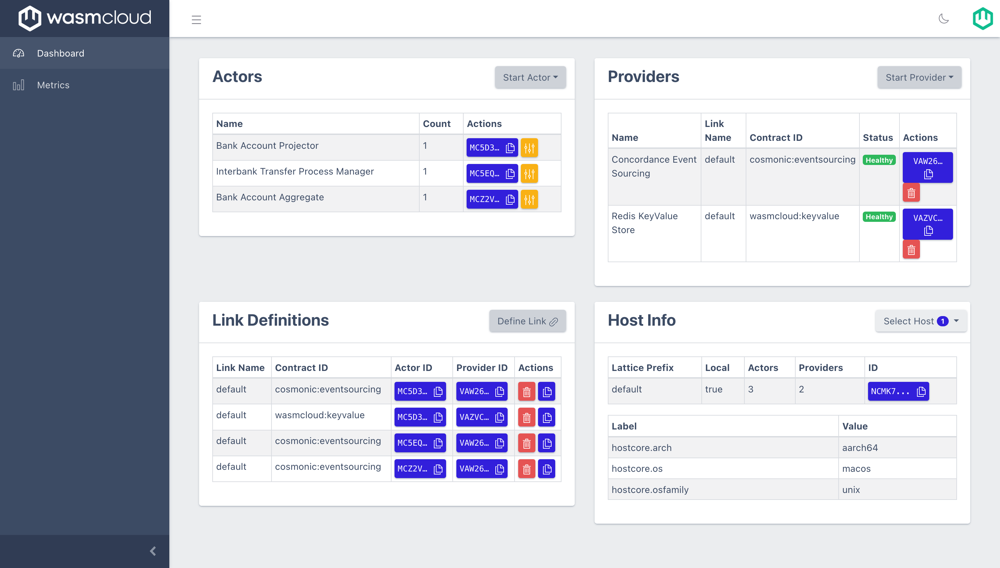

# Concordance Banking Example

This example illustrates all of the core event sourcing building blocks applied to a simplified banking model. In this sample, we have modeled a bank account aggregate, projector, process manager, and an artificial gateway that can be used for testing simulated inter-bank transfers (processes/sagas).

## Step by step guide

To run these examples, use the following steps.

<details>

<summary>

### 0. 📦 Download and set up `wash` and other dependencies

</summary>

To run [wasmCloud][wasmcloud] locally, you'll need to download and install `wash`:

If you have the [rust toolchain][rust-toolchain] installed, you can use `cargo` to install wash:

```console
cargo install wash-cli
```

On a Ubuntu based system this you can use `apt`

```console
sudo apt install wash
```

For other options on how to install `wash`, see [the `wasmcloud/wash`][wash-docs-install].

Along with `wash`, ensure you have access to the following:

- [`nats` CLI](https://docs.nats.io/using-nats/nats-tools/nats_cli) for communicating with NATS
- [`jq`](https://stedolan.github.io/jq/) for displaying and parsing JSON
- [`redis-server`][redis] to use with your [`kvredis` capability provider][wasmcloud-kvredis]

[wasmcloud]: https://wasmcloud.com
[wash-docs-install]: https://github.com/wasmCloud/wash#installing-wash
[rust-toolchain]: https://www.rust-lang.org/tools/install
[redis]: https://redis.io
[wasmcloud-kvredis]: https://github.com/wasmCloud/capability-providers/tree/main/kvredis

</details>

<details>

<summary>

### 1. 🌩️  Start wasmCloud

</summary>

Run an instance of wasmCloud locally by running `wash up`:

```console
wash up
```

You can visit the wasmCloud dashboard (also known as the "washboard") at [https://localhost:4000](https://localhost:4000) (by default).

</details>

<details>

<summary>

### 2. 🛠️ Build all the components

</summary>

You will need to run `make par full` in the `/capability-provider` directory in this repository to generate your own copy of the provider. Once Concordance has had a published release, you'll be able to use its OCI reference.

Next, build all actors in this repository by executing the default target of the Makefile in this folder:

```console
make
```

That command will build the following [identity-verified actors][wasmcloud-signing]:

| Name              | File Path after build                                       | Description                                      |
|-------------------|-------------------------------------------------------------|--------------------------------------------------|
| `process_manager` | `./process_manager/build/bankaccount_processmanager_s.wasm` | The inter-bank transfer process manager |
| `projector`       | `./projector/build/bankaccount_projector_s.wasm`            | Projector for account balance and ledger                  |
| `aggregate`       | `./aggregate/build/bankaccount_aggregate_s.wasm`            | Aggregate that validates commands and emits events |

[wasmcloud-signing]: https://wasmcloud.com/docs/reference/host-runtime/security#actor-identity

</details>

<details>

<summary>

### 3. 🏁 Start relevant providers

</summary>

#### 3.1 Start the `concordance` provider

To facilitate the [Event Sourcing][wiki-es] paradigm, we'll need to use Cosmonic's event sourcing capability provider - `concordance`.

To start the provider, use the washboard to upload `concordance.par.gz`:


When finished, the washboard should display the Concordance provider:



[wiki-es]: https://en.wikipedia.org/wiki/Domain-driven_design#Event_sourcing

#### 3.2 Start the `keyvalue` provider

To store state from actors like the `projector`, the [`keyvalue` redis provider][wasmcloud-kv-provider] can be used.

You can start the `keyvalue` provider by its container image (`wasmcloud.azurecr.io/kvredis:0.19.0`):


[wasmcloud-kv-provider]: https://github.com/wasmCloud/capability-providers/tree/main/kvredis

</details>

<details>

<summary>

### 4. 🏎️ Start the relevant actors

</summary>

Start the `projector`, `process_manager` and `aggregate` actors via the washboard.

For example, to start the `projector` actor:


Follow the same process for `process_manager` and `aggregate` actors.

</details>

<details>

<summary>

### 5. 🔗 Link the actors to the providers

</summary>

To enable communication between the actors and providers, we need to [link them][wasmcloud-docs-linkdefs]. While you can usually use the dashboard to link actors and providers, because one of the providers requires JSON data, we currently have to use the `wash` CLI.

Run the script below to create the links:

```console
export CONCORDANCE_PROVIDER_ID=VAW26CNCVKOTLIJVX2H4WD5T36NKBGWS2GVOIOKAAOOFIJDOJBRFMQZX
export KVREDIS_PROVIDER_ID=VAZVC4RX54J2NVCMCW7BPCAHGGG5XZXDBXFUMDUXGESTMQEJLC3YVZWB

export PROJECTOR_ACTOR_ID=MC5D3GHCW3FN6UWHJDH63VQI36L66YN73OIBFVSM3EXPIC6ZG3AEVTE3
export PROCESS_MANAGER_ACTOR_ID=MC5EQZ6NZY2T5US5JJTCJVAWHETCIIZLLVFUPERSTO2T3AR2NF62JWKI
export AGGREGATE_ACTOR_ID=MCZ2V2VTF4S4QAYKHJTGARIGWFMQXS2FDHKNNI3H7ZHHYAWE6IVCTD7M

# Link projector <-> concordance
wash ctl link put $PROJECTOR_ACTOR_ID $CONCORDANCE_PROVIDER_ID \
    cosmonic:eventsourcing \
    ROLE=projector INTEREST=account_created,funds_deposited,funds_withdrawn,wire_funds_reserved,wire_funds_released NAME=bankaccount_projector

# Link projector <-> keyvalue
wash ctl link put $PROJECTOR_ACTOR_ID $KVREDIS_PROVIDER_ID wasmcloud:keyvalue URL='redis://0.0.0.0:6379/'

# Link process manager <-> concordance
wash ctl link put $PROCESS_MANAGER_ACTOR_ID $CONCORDANCE_PROVIDER_ID \
    cosmonic:eventsourcing \
    ROLE=process_manager KEY=wire_transfer_id NAME=interbankxfer INTEREST='{"start":"wire_transfer_requested","advance":["wire_funds_reserved","interbank_transfer_initiated"],"stop":["interbank_transfer_completed","interbank_transfer_failed"]}'

# Link aggregate <-> concodrance
wash ctl link put $AGGREGATE_ACTOR_ID $CONCORDANCE_PROVIDER_ID \
    cosmonic:eventsourcing \
    ROLE=aggregate KEY=account_number INTEREST=bankaccount NAME=bankaccount
```

⚠️ **WARNING** - The value of `CONCORDANCE_PROVIDER_ID` will be different on your machine when you're building locally. To determine what your provider's public key is, run `wash claims inspect` on the `/capability-provider/build/concordance.par.gz` file in this repository after you've built it. You can also copy this public key from the washboard on port 4000 if you find that easier.

After the script completes, the links should look like the following:

| actor             | provider      | link name | contract ID               | values                                                                                                                                                                                                                                             |
|-------------------|---------------|-----------|---------------------------|----------------------------------------------------------------------------------------------------------------------------------------------------------------------------------------------------------------------------------------------------|
| `projector`       | `concordance` | `default` | `wasmcloud:eventsourcing` | `ROLE=projector,INTEREST=account_created,funds_deposited,funds_withdrawn,wire_funds_reserved,wire_funds_released,NAME=bankaccount_projector`                                                                                                       |
| `projector`       | `keyvalue`    | `default` | `wasmcloud:keyvalue`      | `URL='redis://0.0.0.0:6379/'`                                                                                                                                                                                                                      |
| `process_manager` | `concordance` | `default` | `wasmcloud:eventsourcing` | `ROLE=process_manager,KEY=wire_transfer_id,NAME=interbankxfer,INTEREST='{"start":"wire_transfer_requested","advance":["wire_funds_reserved","interbank_transfer_initiated"],"stop":["interbank_transfer_completed","interbank_transfer_failed"]}'` |
| `aggregate`       | `concordance` | `default` | `wasmcloud:eventsourcing` | `ROLE=aggregate,KEY=account_number,INTEREST=bankaccount,NAME=bankaccount`                                        |

Once the script has been run, your dashboard should look like the following:



Follow the same process for all other links.

[wasmcloud-docs-linkdefs]: https://wasmcloud.com/docs/reference/host-runtime/links/

</details>

<details>

<summary>

### 6. 🚀 Run the Event Sourcing scenario

</summary>

With all the pieces of the concordance demo running, you can check the state of the system with `nats stream list`:

```console
$ nats stream list
╭────────────────────────────────────────────────────────────────────────────────────────────────────────────────────────────────────────╮
│                                                                Streams                                                                 │
├─────────────┬───────────────────────────────────────────────────────────────────┬─────────────────────┬──────────┬──────┬──────────────┤
│ Name        │ Description                                                       │ Created             │ Messages │ Size │ Last Message │
├─────────────┼───────────────────────────────────────────────────────────────────┼─────────────────────┼──────────┼──────┼──────────────┤
│ CC_COMMANDS │ Concordance command stream for event sourcing capability provider │ 2023-04-11 01:51:24 │ 0        │ 0 B  │ never        │
│ CC_EVENTS   │ Concordance event stream for event sourcing capability provider   │ 2023-04-11 01:51:24 │ 0        │ 0 B  │ never        │
╰─────────────┴───────────────────────────────────────────────────────────────────┴─────────────────────┴──────────┴──────┴──────────────╯
```

Here we can observe that the NATS streams that will carry our event sourcing traffic have been created successfully.

> *NOTE* At this point if you wanted to *reset* their contents, you could do so with the following commands:
>
> ```console
> nats stream purge CC_EVENTS -f
> nats stream purge CC_COMMANDS -f
> ```

To set the system in motion, from the `examples/bankaccount` directory (where this README is), we can execute a simple scenario:

**First, we create an account `ABC123` with an intiial balance of 4000 cents (used to avoid floating point friction), the event sourcing way (by creating a command):**

```console
nats req cc.commands.bankaccount "`cat ./scripts/create_account_cmd.json | jq -c`"
```

> **NOTE** If this command is successful, you should see output like:
>
> ```
> 03:31:42 Sending request on "cc.commands.bankaccount"
> 03:31:42 Received with rtt 312.417µs
> {"stream":"CC_COMMANDS", "domain":"core", "seq":1}
> ```

**Then we create a deposit in account `ABC123` for 3000 (30 dollars)**:

```console
nats req cc.commands.bankaccount "`cat ./scripts/deposit_cmd_1.json | jq -c`"
```

**We can then create a second deposit for 1000 cents**:

```console
nats req cc.commands.bankaccount "`cat ./scripts/deposit_cmd_2.json | jq -c`"
```

**Finally, we make a withdrawal of 2000 cents**:

```console
nats req cc.commands.bankaccount "`cat ./scripts/withdraw_cmd_1.json | jq -c`"
```

If you're good at quick math, you already know the amount that should be in the state at the end of our scenario:

4000 + 3000 + 1000 - 2000 = 6000

Let's check if we have 6000 cents:

```
$ nats kv get CC_STATE agg.bankaccount.ABC123
CC_STATE > agg.bankaccount.ABC123 created @ 10 Apr 23 18:32 UTC

{"balance":6000,"min_balance":100,"reserved_amount":0,"account_number":"ABC123","customer_id":"CUSTBOB"}
```

You can also confirm that state was persisted in redis if you have [`redis-cli`][redis-cli] installed:

```
$ redis-cli get balance.ABC123
"6000"
```

You can also see a JSON representation of the account ledger by using the Redis CLI to query the `ledger.ABC123` key.

🎉 Congratulations, you've completed the demo and run a fully scalable and resilient event sourced application with the safety and performance of WebAssembly! 🎉

[redis-cli]: https://redis.io/docs/ui/cli/

</details>
