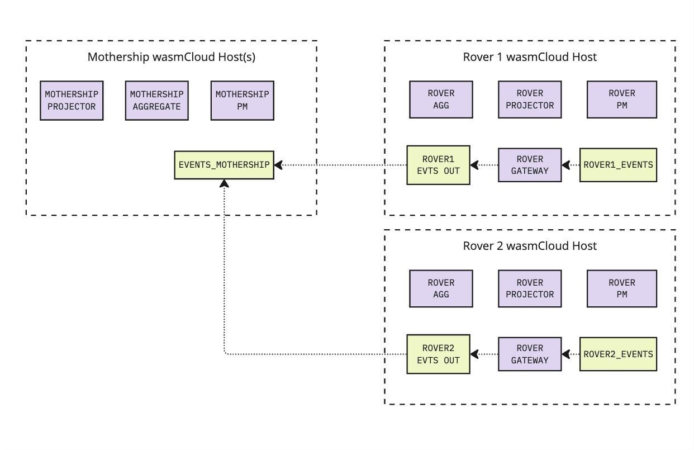

## DDIL - Degraded, Disconnected, Intermittent, Limited Bandwidth
Distributed systems are hard. It's easy to design them poorly, it's easy to implement them poorly, and even the best, brightest, and most talented people can do both. Conceptualizing your application as a loose collection of pieces of compute distributed across a heterogeneous network takes some getting used to.

Taking the next step is even harder. In many applications, not all parts of the distributed system are in direct contact with each other all the time. Worse, we are often not in control of the frequency and duration of these gaps in connectivity. Cell phones can go into tunnels, satellites can move out of range of ground receivers, and distant rovers on far flung planets can't reach the home planet directly at all, they have to wait for any number of intervening satellite relays to line up.

## Concordance
Concordance is an opinionated event sourcing framework that builds a platform on top of wasmCloud. Modeling your application in terms of the various building blocks of event sourced applications means you can focus on your business logic and not have to worry about the infrastructure.

The idea behind both wasmCloud and Concordance is that your code _does not need to change_ to support different types of infrastructure. As you'll see below, the entire design for DDIL doesn't involve writing _any_ code that is aware of the network topology or QoS (quality of service).

## Design

When a new Rover is created (physically or virtually), a NATS leaf node is spun up on that device. It authenticates as part of the same account as all other rovers and the mothership. Within each of these leaf nodes is a "mini Concordance" environment. There is a local event stream (in the diagram below, these are `ROVER1_EVENTS` and `ROVER2_EVENTS`). All of the local components interact with this local event stream.

This use of an isolated, local event stream allows all of the autonomous agents running on the rover to continue running even when they do not have access to the mothership directly.

On the mothership, there is also a local event stream and local components running on that mothership's leaf node. It uses a local event stream called `EVENTS_MOTHERSHIP`. This stream pulls from all rovers whenever they're connected by treating each of their "outbound" or "upstream" streams as a **_source_**.

Residing on each leaf node is a gateway (which can be a regular process or it can be a wasmCloud actor bound to the messaging contract with 2 different link names). This gateway monitors the local event stream and, whenever appropriate, emits high-level events (or sampling of regular events) to the "outbound" stream. This stream is one of many sources for the `EVENTS_MOTHERSHIP` stream.

## Why Does This Matter?
This matters because I can run this entire application on a single NATS server on my laptop while I'm developing it locally. I can then use it for real on a mothership in orbit supporting a bunch of rovers. Then I can put a bunch of orbital satellite relays around even more planets which periodically connect back to the mothership. This change in topology is completely transparent to the application. My code continues to work the way it's supposed to, it continues to be ignorant of the underlying network topology, and I never have to redesign, rebuild, or redeploy my application unless I'm changing core feature logic.

All of the hard parts of dealing with occasionally connected distributed systems is handled by NATS, NATS leaf nodes, and proper configuration of NATS JetStream streams, sources, and replicas.

